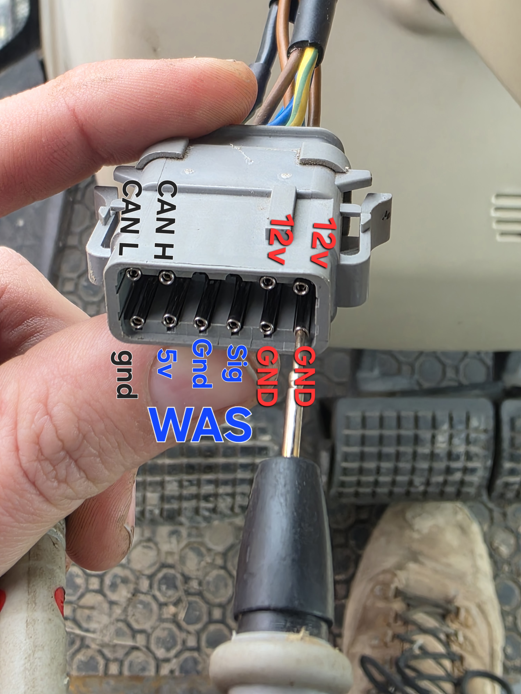

# Machinery Guide Steer Motor – Full Reverse Engineering README

Stepper-motor based steering motor by **Machinery Guide**.

This document consolidates:
- wiring & connectors  
- CAN message roles  
- byte-level decoding  
- PGN-based command structure  
- steering & calibration logic  
- automatic steering configuration parameters  

Designed so an AI tool or software implementation can be generated without additional explanation.

---

## General Information

- **Bus:** CAN  
- **Bitrate:** 250 kbps  
- **Motor type:** Internal stepper motor  
- **Main connector:** DTM 12P  

---

## Connector Pinout



### Power & Wheel Angle Sensor (WAS)

| Wire color | Function |
|------------|----------|
| Blue | GND (2× for power input, 1× for WAS) |
| Brown | +12 V |
| Brown (separate) | WAS +5 V output |
| Yellow/Green stripe | WAS signal (appears digital on oscilloscope) |

Wheel angle value seems to be some kind of 1 wire digital signal. When disconnected (all 3 wires) the motor thinks it's at the center position. That's why it's possible to steer it with position commands. (It disables itself after a couple seconds as the WAS value doesn't change. ERROR led lights up, but sending a new angle + start command resets it.)

### CAN Bus

| Wire color | Function |
|------------|----------|
| Red | CAN_H |
| Green | CAN_L |
| Black | CAN_GND |

---

## CAN Message Roles

| CAN ID | Direction | Role |
|--------|-----------|------|
| **0x500** | Controller → Motor | Commands & configuration |
| **0x50F** | Motor → Controller | Periodic feedback (10 Hz) |
| **0x503** | Motor → Controller | ACK / state response |


| PGN (Byte0) | Bytes Used      | Byte1–2 Meaning              | Value Type                | Purpose                                      |
| ----------- | --------------- | ---------------------------- | ------------------------- | -------------------------------------------- |
| **0x02**    | 2 bytes (B1,B2) | Target steering angle        | `int16` (signed)          | Steering command (left/right, centered at 0) |
| **0x03**    | none            | —                            | —                         | Stop / disable motor                         |
| **0x04**    | none            | —                            | —                         | Start / enable motor                         |
| **0x06**    | 2 bytes         | Extra torque value (percent) | `uint16` / %              | Extra motor torque setting                   |
| **0x08**    | 2 bytes         | Left endstop value           | `uint16`                  | Left steering limit                          |
| **0x0D**    | 2 bytes         | Config flag / mode           | `uint16`                  | Unknown configuration parameter              |
| **0x0F**    | 2 bytes         | Right endstop value          | `int16` (observed signed) | Right steering limit                         |
| **0x13**    | 2 bytes         | Ramp parameter A             | `uint16`                  | Acceleration / ramp tuning                   |
| **0x15**    | 2 bytes         | Ramp parameter B             | `uint16`                  | Acceleration / ramp tuning                   |
| **0x17**    | 2 bytes         | Config parameter             | `uint16`                  | Unknown tuning parameter                     |
| **0x19**    | 2 bytes         | Config parameter             | `uint16`                  | Unknown tuning parameter                     |
| **0x1D**    | 2 bytes         | Manual override sensitivity  | `uint16` / %              | Driver override sensitivity                  |
| **0x22**    | none            | —                            | —                         | Calibration trigger                          |
| **0x25**    | 1 byte (B1)     | Config flag                  | `uint8`                   | Unknown parameter                            |
| **0x30**    | 1 byte (B1)     | Encoder type (0/1)           | `uint8`                   | 0 = 360 imp/rev, 1 = 1000 imp/rev            |
| **0xFF**    | none            | —                            | —                         | End of configuration block                   |


---

## Byte-Level Decoding Rules

```c
uint16_t u16 = (B1 << 8) | B2;
int16_t  i16 = (int16_t)u16;
```

- Big-endian
- Used for angle and configuration values

---

# PGN-Based Command Structure (CAN ID = 0x500)

**Byte 0 = PGN (command selector)**  
**Byte 1–2 = value for that PGN**

General format:
```
CAN ID: 0x500
Byte0 = PGN
Byte1 = Value MSB (if used)
Byte2 = Value LSB (if used)
```

---

## PGN List

### PGN 0x02 – Steering Target Angle

```
500: 02 XX YY
```

Decode (signed):
```c
int16_t target = (int16_t)((XX << 8) | YY);
```

Examples:

| Hex | Decimal | Meaning |
|-----|---------|---------|
| 02 FF FF | -1 | Center |
| 02 00 00 | 0 | Center |
| 02 00 20 | 32 | Small left |
| 02 00 50 | 80 | Medium left |
| 02 0F 00 | 3840 | Full left |
| 02 FF 50 | -176 | Medium right |

Range: approx **-2500 … +2500** (signed)
Theory: The wheel angle itself might go from -25.00 to 25.00 degrees

---

### PGN 0x03 – Stop Motor

```
500: 03
```

---

### PGN 0x04 – Start Motor

```
500: 04
```

Needs to be sent after the target angle.

---

### PGN 0x06 – Extra Torque

```
500: 06 00 XX
```

| Hex | Decimal | Percent |
|-----|---------|---------|
| 1F | 31 | 31% |
| 64 | 100 | 100% |

---

### PGN 0x08 – Left Endstop

```
500: 08 XX YY
```

| Hex | Decimal |
|-----|---------|
| 00 0D | 13 |
| 00 0B | 11 |

---

### PGN 0x0D – Unknown Config Flag

```
500: 0D 00 01
```

---

### PGN 0x0F – Right Endstop

```
500: 0F XX YY
```

Example:
| Hex | Decimal |
|-----|---------|
| FF F9 | -7 (signed) |

---

### PGN 0x13 – Ramp Parameter A

```
500: 13 XX YY
```

---

### PGN 0x15 – Ramp Parameter B

```
500: 15 XX YY
```

Ramp scaling:

| Hex | Decimal | Percent |
|-----|---------|---------|
| 01 DC | 476 | 1% |
| 04 88 | 1160 | 10% |
| 06 E8 | 1768 | 18% |
| 1F 40 | 8000 | 100% |

---

### PGN 0x17 – Unknown Parameter

```
500: 17 00 58
```

---

### PGN 0x19 – Unknown Parameter

```
500: 19 03 E8
```

---

### PGN 0x1D – Manual Override Sensitivity

```
500: 1D 00 XX
```

| Hex | Decimal | Meaning |
|-----|---------|---------|
| 57 | 87 | Sensitivity |
| 53 | 83 | ~17% |

---

### PGN 0x22 – Calibration Trigger

```
500: 22
```

---

### PGN 0x25 – Unknown Parameter

```
500: 25 00
```

---

### PGN 0x30 – Encoder Type

```
500: 30 00 | 01
```

| Value | Meaning |
|-------|--------|
| 00 | 360 pulses / rev |
| 01 | 1000 pulses / rev |

---

### PGN 0xFF – End of Configuration Block

```
500: FF
```

---

# Motor Feedback (CAN ID = 0x50F)

Format:
```
50F: B0 B1 B2
```

## B0 = 0x01 – Wheel Angle Feedback

```c
int16_t angle = (int16_t)((B1 << 8) | B2);
```

Examples:
| Hex | Decimal |
|-----|---------|
| F6 90 | -2416 |
| 03 E0 | 992 |

Negative = left  
Positive = right  
Zero = center  

---

## B0 = 0x00 – Status / Unknown Internal Value

```c
uint16_t status = (B1 << 8) | B2;
```

Meaning unknown (likely internal diagnostics/state).

---

# ACK / State (CAN ID = 0x503)

| Data | Meaning |
|------|--------|
| 01 | ACK / calibration started |
| 02 | Calibration complete / stop |

---

# Calibration Behavior

Wheel angle feedback shows:
- sinus-like oscillation
- increasing amplitude
- settling near reference
- completion with PGN 0x503 = 02

---

# Decimal ↔ Hex Conversion

| Decimal | Hex |
|---------|-----|
| 31 | 0x1F |
| 476 | 0x01DC |
| 1160 | 0x0488 |
| 1768 | 0x06E8 |
| 8000 | 0x1F40 |
| -7 | 0xFFF9 |

Formula:
```c
hex = decimal & 0xFFFF;
decimal = (int16_t)hex;
```

---

# Summary

- Byte0 = PGN (command selector)
- Byte1–2 = value
- Steering uses signed int16
- Configuration uses unsigned int16 / percentages
- Calibration via PGN 0x22
- Feedback via CAN ID 0x50F
- ACK via CAN ID 0x503

---

# Open Questions

- Physical unit scaling (counts → degrees)
- Meaning of status frame (0x50F B0=00)
- Full decoding of unknown PGNs

